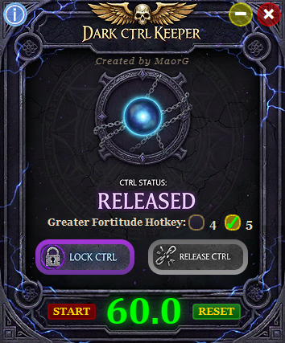

# 🎮 DarkCtrlKeeper

<div align="center">

**Dark Fantasy Themed CTRL Key Locker for MU Online**

[](https://opensource.org/licenses/MIT)
[](https://www.python.org/downloads/)
[](https://www.riverbankcomputing.com/software/pyqt/)

*Maintain your Greater Fortitude buff with style* ✨



</div>

---

## 📖 Table of Contents

- [Overview](#-overview)
- [Features](#-features)
- [Quick Start](#-quick-start)
- [Installation](#-installation)
- [Usage](#-usage)
- [Building from Source](#-building-from-source)
- [Configuration](#-configuration)
- [Documentation](#-documentation)
- [Security](#-security)
- [Contributing](#-contributing)
- [License](#-license)

---

## 🌟 Overview

**DarkCtrlKeeper** is a professional Windows desktop application designed specifically for MU Online gamers. It provides CTRL key locking functionality to maintain continuous auto-attack and includes an intelligent buff timer for tracking the Greater Fortitude skill duration.

### Why DarkCtrlKeeper?

- **🎯 Purpose-Built:** Designed specifically for MU Online's Greater Fortitude buff management
- **🎨 Beautiful UI:** Dark fantasy themed interface that complements MU Online's aesthetic
- **🔒 Safe & Secure:** Open source, no data collection (unless you opt-in to analytics)
- **💻 Professional:** Built with modern Python, PyQt6, and best practices

---

## ✨ Features

### Core Functionality

- **🔐 CTRL Key Locking**
  - Virtually press and hold CTRL key for continuous auto-attack
  - Instant release with button click
  - Safe cleanup ensures CTRL is never stuck

- **⏱️ Greater Fortitude Timer**
  - 60-second countdown with automatic reset
  - Detects when you press your buff hotkey (4 or 5)
  - Color-coded warnings: Green → Yellow → Red
  - Visual "BUFF" alert when timer expires

### User Experience

- **🎨 Dark Fantasy UI**
  - Custom-designed gothic interface
  - Beautiful PNG assets with glowing effects
  - Transparent, frameless, always-on-top window
  - Draggable to position anywhere on screen

- **⚙️ Customization**
  - Choose between hotkey 4 or 5 for buff tracking
  - Stop/Resume timer controls
  - Manual reset button

### Advanced Features

- **📊 Optional Analytics** (Privacy-Focused)
  - Google Analytics 4 integration for usage tracking
  - Completely optional - works perfectly without it
  - No personal data collected
  - See [GA4 Tracking Guide](docs/GA4_TRACKING_GUIDE.md)

- **🔒 Administrator Privileges**
  - Automatically requests UAC elevation
  - Required for global keyboard control

---

## 🚀 Quick Start

### For Users (Easiest)

1. **Download** the latest release from [GitHub Releases](https://github.com/maorga/DarkCtrlKeeper/releases)
2. **Extract** the ZIP file to your preferred location
3. **Run** `DarkCtrlKeeper.exe`
4. **Click "Yes"** when Windows asks for administrator privileges

That's it! See [Quick Start Guide](docs/QUICKSTART.md) for detailed instructions.

### For Developers

```powershell
# Clone repository
git clone https://github.com/maorga/DarkCtrlKeeper.git
cd DarkCtrlKeeper

# Create virtual environment
python -m venv venv
.\venv\Scripts\Activate.ps1

# Install dependencies
pip install -r requirements.txt

# Run from source
python src/main.py
```

---

## 📦 Installation

### System Requirements

- **OS:** Windows 10/11 (primary), Windows 7/8 (untested)
- **Python:** 3.8 or higher (for running from source)
- **RAM:** ~150MB
- **Disk:** ~50MB

### Option 1: Pre-Built Executable (Recommended)

1. Go to [Releases](https://github.com/maorga/DarkCtrlKeeper/releases)
2. Download `DarkCtrlKeeper_v1.0.0.zip`
3. Extract to `C:\Games\DarkCtrlKeeper` (or any location)
4. Run `DarkCtrlKeeper.exe`

### Option 2: Install from Source

```powershell
# 1. Clone the repository
git clone https://github.com/maorga/DarkCtrlKeeper.git
cd DarkCtrlKeeper

# 2. Create virtual environment (recommended)
python -m venv venv

# 3. Activate virtual environment
.\venv\Scripts\Activate.ps1  # PowerShell
# OR
.\venv\Scripts\activate.bat   # Command Prompt

# 4. Install dependencies
pip install -r requirements.txt

# 5. (Optional) Configure analytics
Copy-Item .env.example .env
# Edit .env with your GA4 credentials

# 6. Run the application
python src/main.py
```

---

## 🎮 Usage

### Basic Workflow

1. **Launch the application**
   - Double-click `DarkCtrlKeeper.exe` or run `python src/main.py`
   - Click "Yes" on UAC prompt

2. **Lock CTRL for auto-attack**
   - Click "Lock CTRL" button (left)
   - Status changes to "CTRL IS PRESSED" (red)

3. **Cast Greater Fortitude**
   - Press **4** or **5** in MU Online (select in app)
   - Countdown automatically resets to 60.0 seconds

4. **Monitor buff duration**
   - **Green (60-30s):** Safe, plenty of time
   - **Yellow (30-10s):** Prepare to rebuff soon
   - **Red (10-0s):** Rebuff NOW!
   - **BUFF Alert:** Buff has expired

5. **Release CTRL when needed**
   - Click "Release CTRL" button (right)

### Keyboard Shortcuts

| Key | Action |
|-----|--------|
| **4 or 5** | Reset countdown to 60.0 (based on your selection) |

### Tips & Tricks

- **Positioning:** Drag the window to position it near your MU Online window
- **Multiple Accounts:** Run multiple instances for different characters
- **Timer Control:** Use STOP to pause, RESET to manually reset
- **Safe Exit:** Always releases CTRL automatically when closed

See [USAGE.md](USAGE.md) for comprehensive usage instructions.

---

## ⚠️ Disclaimer

This software is provided for educational and convenience purposes only. 

- **Game Terms of Service:** Users are responsible for ensuring compliance with MU Online's Terms of Service
- **Use at Own Risk:** The author is not responsible for any game account actions
- **No Affiliation:** Not affiliated with, endorsed by, or connected to MU Online or Webzen
- **Local Use Only:** This tool operates locally and does not modify game files or memory

By using this software, you acknowledge that you use it at your own discretion and risk.

---

## 🎯 Official Repository
This is the **original** DarkCtrlKeeper by [@MaorG](https://github.com/maorg).

⚠️ **Beware of forks that:**
- Remove credits
- Add malware
- Charge money for free software

✅ **Always download from official releases only**

---

## 🏗️ Building from Source

### Prerequisites

```powershell
# Install PyInstaller
pip install pyinstaller

# Verify all assets are present
Get-ChildItem assets\
```

### Build Executable

```powershell
# Run build script
python scripts/build.py

# Output location
dir dist\DarkCtrlKeeper\

# Test the executable
.\dist\DarkCtrlKeeper\DarkCtrlKeeper.exe
```

### Build Configuration

The build uses these PyInstaller settings:
- `--onedir`: Creates folder structure (not single file)
- `--windowed`: No console window
- `--uac-admin`: Requests administrator privileges
- `--noupx`: No compression (better antivirus compatibility)
- `--icon`: Uses `assets/ICON.ico`

See [scripts/build.py](scripts/build.py) for full configuration.

---

## ⚙️ Configuration

### Optional Analytics (Google Analytics 4)

Analytics is **completely optional**. The app works perfectly without it.

**To enable analytics:**

1. Create a Google Analytics 4 property
2. Copy `.env.example` to `.env`
3. Fill in your credentials:
   ```bash
   GA4_MEASUREMENT_ID=G-XXXXXXXXXX
   GA4_API_SECRET=your_secret_here
   ```

**To disable analytics:**
- Don't create a `.env` file (default)
- OR delete the `.env` file
- OR leave GA4 fields empty

See [GA4 Tracking Guide](docs/GA4_TRACKING_GUIDE.md) for detailed setup instructions.

### Environment Variables

| Variable | Description | Default |
|----------|-------------|---------|
| `GA4_MEASUREMENT_ID` | Google Analytics 4 Measurement ID | (none) |
| `GA4_API_SECRET` | GA4 API Secret | (none) |
| `APP_VERSION` | Application version for tracking | `1.0.0` |
| `DEBUG` | Enable debug mode (`true`/`false`) | `false` |

---

## 📚 Documentation

### User Documentation
- **[Quick Start Guide](docs/QUICKSTART.md)** - Get up and running in 5 minutes
- **[Usage Guide](USAGE.md)** - Comprehensive usage instructions
- **[Changelog](CHANGELOG.md)** - Version history and changes

### Developer Documentation
- **[Project Summary](docs/PROJECT_SUMMARY.md)** - Technical architecture overview
- **[Implementation Summary](IMPLEMENTATION_SUMMARY.md)** - Implementation notes
- **[Build Fix Summary](BUILD_FIX_SUMMARY.md)** - Build troubleshooting

### Security & Privacy
- **[Security Policy](docs/SECURITY.md)** - Security best practices
- **[GA4 Tracking Guide](docs/GA4_TRACKING_GUIDE.md)** - Analytics setup and privacy

### Reference
- **[Interface Specs](INTERFACE_SPECS.md)** - UI specifications
- **[Visual Layout Guide](VISUAL_LAYOUT_GUIDE.md)** - Design guidelines

---

## 🔒 Security

### For Users

- ✅ **Open Source:** All code is visible and auditable
- ✅ **No Spyware:** Zero data collection without opt-in
- ✅ **Safe Download:** Only download from official GitHub releases
- ✅ **Administrator Required:** Needed for keyboard control (normal)

### For Developers

- ✅ **Secrets Management:** Never commit `.env` or API keys
- ✅ **Environment Variables:** All secrets loaded from `.env`
- ✅ **Comprehensive .gitignore:** Prevents accidental secret commits
- ✅ **Dependencies Pinned:** Exact versions in `requirements.txt`

**Read the full [Security Policy](docs/SECURITY.md)**

### Reporting Vulnerabilities

Found a security issue? Please **DO NOT** open a public issue. Email the maintainer directly at [your.email@example.com].

---

## 🤝 Contributing

Contributions are welcome! Here's how you can help:

### Ways to Contribute

1. **🐛 Report Bugs:** Open an issue with detailed steps to reproduce
2. **💡 Suggest Features:** Share your ideas in GitHub Issues
3. **📝 Improve Documentation:** Fix typos, add examples, clarify instructions
4. **🔧 Submit Code:** Fork, create a branch, and submit a pull request

### Development Setup

```powershell
# Fork and clone your fork
git clone https://github.com/YOUR_USERNAME/DarkCtrlKeeper.git
cd DarkCtrlKeeper

# Create feature branch
git checkout -b feature/your-feature-name

# Make changes and test
python src/main.py

# Run tests (if pytest installed)
pytest tests/

# Commit and push
git add .
git commit -m "Add your feature"
git push origin feature/your-feature-name

# Open pull request on GitHub
```

### Coding Standards

- Follow PEP 8 style guide
- Add docstrings to functions and classes
- Write tests for new features
- Update documentation as needed
- No secrets in commits

---

## 📜 License

This project is licensed under the **MIT License**.

```
MIT License

Copyright (c) 2025 MaorG

Permission is hereby granted, free of charge, to any person obtaining a copy
of this software and associated documentation files (the "Software"), to deal
in the Software without restriction, including without limitation the rights
to use, copy, modify, merge, publish, distribute, sublicense, and/or sell
copies of the Software, and to permit persons to whom the Software is
furnished to do so, subject to the following conditions:

The above copyright notice and this permission notice shall be included in all
copies or substantial portions of the Software.

THE SOFTWARE IS PROVIDED "AS IS", WITHOUT WARRANTY OF ANY KIND, EXPRESS OR
IMPLIED, INCLUDING BUT NOT LIMITED TO THE WARRANTIES OF MERCHANTABILITY,
FITNESS FOR A PARTICULAR PURPOSE AND NONINFRINGEMENT. IN NO EVENT SHALL THE
AUTHORS OR COPYRIGHT HOLDERS BE LIABLE FOR ANY CLAIM, DAMAGES OR OTHER
LIABILITY, WHETHER IN AN ACTION OF CONTRACT, TORT OR OTHERWISE, ARISING FROM,
OUT OF OR IN CONNECTION WITH THE SOFTWARE OR THE USE OR OTHER DEALINGS IN THE
SOFTWARE.
```

See [LICENSE](LICENSE) for full text.

---

## 🙏 Acknowledgments

- **PyQt6** - Powerful cross-platform GUI framework
- **pynput** - Reliable cross-platform keyboard control
- **MU Online Community** - Inspiration and feedback
- **Contributors** - Thank you to everyone who has contributed!

---

## 💬 Support & Contact

### Getting Help

- **📖 Documentation:** Check the [docs/](docs/) folder
- **🐛 Bug Reports:** [GitHub Issues](https://github.com/maorga/DarkCtrlKeeper/issues)
- **💡 Feature Requests:** [GitHub Issues](https://github.com/maorga/DarkCtrlKeeper/issues)
- **💬 Discussions:** [GitHub Discussions](https://github.com/maorga/DarkCtrlKeeper/discussions)

### Maintainer

- **GitHub:** [@maorga](https://github.com/maorga)
- **Repository:** [DarkCtrlKeeper](https://github.com/maorga/DarkCtrlKeeper)

---

## 🎯 Project Status

**Status:** ✅ Production Ready  
**Version:** 1.0.0  
**Last Updated:** November 12, 2025

### Roadmap

- [ ] Multiple buff timers
- [ ] Customizable hotkeys
- [ ] Sound notifications
- [ ] macOS/Linux support
- [ ] Tray icon integration

---

<div align="center">

**Made with ❤️ for the MU Online community**

⭐ **Star this project if you find it useful!** ⭐

[Report Bug](https://github.com/maorga/DarkCtrlKeeper/issues) · [Request Feature](https://github.com/maorga/DarkCtrlKeeper/issues) · [Documentation](docs/)

</div>